# Dilcore-InfraAsCode

**Infrastructure Deployments:**

**Configuration Deployments:**

This repository contains the Infrastructure as Code (IaC) definitions for the Dilcore project.

## Infra

The infrastructure is managed using Terraform and is organized into modular components.

- **[Shared Infrastructure](./infra/shared/)**: This is the base of the infrastructure setup. It contains the foundational components such as the Container App Environment, App Configuration, and Log Analytics Workspace. It must be provisioned before other modules.
- **[Platform Infrastructure](./infra/platform/)**: This module contains the platform-specific resources, including the main API Container App and Storage Account for Orleans Grains. It has a direct relation to the container app environment provisioned in the shared module.
- **[MongoDB Infrastructure](./infra/mongodb/)**: This module manages the MongoDB Atlas resources, including the Atlas Project and Cluster. It stores the connection string in the shared App Configuration.
- **[Auth0 Infrastructure](./infra/auth0/)**: This module manages Auth0 authentication resources, including the API Resource Server and OAuth2 clients for the Web App and API Documentation. Auth0 credentials and configuration are stored in App Configuration for use by the Platform API.
- **[OpenRouter Infrastructure](./infra/open-router-models/)**: This module manages OpenRouter API keys and credit limits for the AI Core project. It provides secure access to external AI models.

### Infrastructure Overview

The following diagram illustrates the relationship between the Shared, Platform, MongoDB, and Auth0 infrastructure components.

```mermaid
graph TD
    subgraph Shared_Infrastructure["Shared Infrastructure"]
        style Shared_Infrastructure fill:#e3f2fd,stroke:#1565c0,stroke-width:2px
        subgraph SharedRG["Shared Resource Group"]
            style SharedRG fill:#ffffff,stroke:#90caf9
            LAW["Log Analytics Workspace"]
            AppConfig["App Configuration"]
            AppInsights["Application Insights"]
            CAE["Container App Environment"]
        end
    end

    subgraph Platform_Infrastructure["Platform Infrastructure"]
        style Platform_Infrastructure fill:#f3e5f5,stroke:#7b1fa2,stroke-width:2px
        subgraph PlatformRG["Platform Resource Group"]
            style PlatformRG fill:#ffffff,stroke:#ce93d8
            ContainerApp["Container App (API)"]
            Storage["Storage Account"]
        end
    end
    
    subgraph MongoDB_Infrastructure["MongoDB Infrastructure"]
        style MongoDB_Infrastructure fill:#e8f5e9,stroke:#2e7d32,stroke-width:2px
        subgraph Atlas["MongoDB Atlas"]
            style Atlas fill:#ffffff,stroke:#a5d6a7
            AtlasCluster["Atlas Cluster"]
        end
    end

    subgraph Auth0_Infrastructure["Auth0 Infrastructure"]
        style Auth0_Infrastructure fill:#fff3e0,stroke:#e65100,stroke-width:2px
        subgraph Auth0Tenant["Auth0 Tenant"]
            style Auth0Tenant fill:#ffffff,stroke:#ffb74d
            Auth0API["API Resource Server"]
            Auth0WebApp["Web App Client"]
            Auth0APIDoc["API Doc Client"]
        end
    end

    subgraph OpenRouter_Infrastructure["OpenRouter Infrastructure"]
        style OpenRouter_Infrastructure fill:#e0f7fa,stroke:#00838f,stroke-width:2px
        subgraph OpenRouter["OpenRouter API"]
            style OpenRouter fill:#ffffff,stroke:#4dd0e1
            OpenRouterKey["API Key (AI Core)"]
        end
    end

    %% Cross-Group Relationships
    ContainerApp -->|Hosted In| CAE
    ContainerApp -->|Reads Settings| AppConfig
    ContainerApp -->|Read/Write| Storage
    ContainerApp -->|Connects To| AtlasCluster
    ContainerApp -->|Validates JWT| Auth0API
    ContainerApp -->|Uses AI Models| OpenRouterKey
    
    %% Logging & Monitoring
    AppInsights -->|Logs| LAW
    CAE -->|Logs| LAW
    
    %% Configuration Flow (Terraform managed)
    Storage -.->|Connection String| AppConfig
    AppInsights -.->|Connection String| AppConfig
    AtlasCluster -.->|Connection String| AppConfig
    Auth0API -.-|Domain, Audience| AppConfig
    Auth0WebApp -.-|Client ID, Secret| AppConfig
    Auth0APIDoc -.-|Client ID, Secret| AppConfig
    OpenRouterKey -.-|API Key| AppConfig
```

## Configuration

The [configurations](./configurations/) directory contains the Configuration as Code (CaC) system that deploys application settings and feature flags to Azure App Configuration. The system uses a centralized Terraform module to process JSON configuration files for different components (`platform`, `shared`) and environments.

**Key Features:**
- **Unified Terraform Module:** Dynamically loads and deploys configurations based on component and environment
- **Feature Flags:** Dedicated `flags.json` files for Azure Feature Manager integration
- **Variable Replacement:** Supports `$(VARIABLE_NAME)` placeholders for secrets and infrastructure outputs
- **Environment-Specific:** Separate configuration files for development, qa, staging, and production

**Integration with Infrastructure:**
Configuration files reference infrastructure outputs through variable placeholders. For example:
- MongoDB connection strings from the MongoDB module
- Auth0 credentials from the Auth0 module
- Storage account names from the Platform module
- Application Insights connection strings from the Shared module

These placeholders are replaced during CI/CD deployment with actual values from Azure App Configuration and Terraform outputs.

For detailed information, see the [Configuration README](./configurations/README.md).
