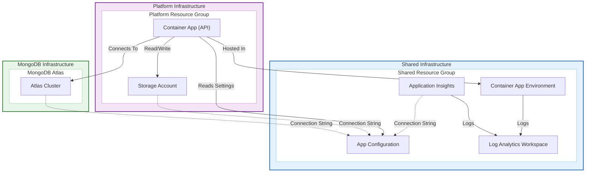

# Dilcore-InfraAsCode

This repository contains the Infrastructure as Code (IaC) definitions for the Dilcore project.

## Infra

The infrastructure is managed using Terraform and is organized into modular components.

- **[Shared Infrastructure](./infra/shared/)**: This is the base of the infrastructure setup. It contains the foundational components such as the Container App Environment, App Configuration, and Log Analytics Workspace. It must be provisioned before other modules.
- **[Platform Infrastructure](./infra/platform/)**: This module contains the platform-specific resources, including the main API Container App. It has a direct relation to the container app environment provisioned in the shared module.
- **[MongoDB Infrastructure](./infra/mongodb/)**: This module manages the MongoDB Atlas resources, including the Atlas Project and Cluster. It stores the connection string in the shared App Configuration.

### Infrastructure Overview

The following diagram illustrates the relationship between the Shared, Platform, and MongoDB infrastructure components.

## Configuration

Configuration will be implemented soon.
