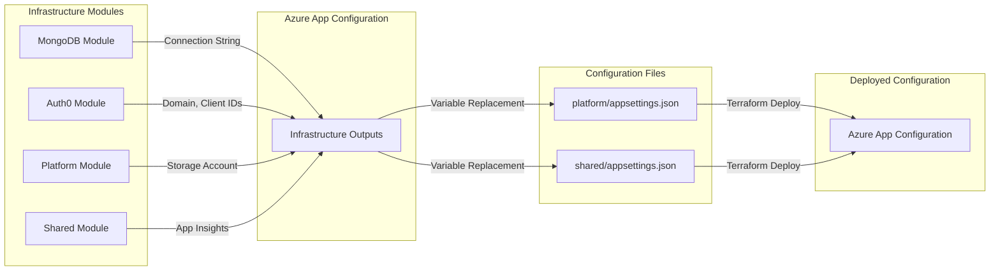

# Configuration As Code (CaC) - Deployment System

This folder contains the centralized Configuration As Code system used to deploy application settings and feature flags to Azure App Configuration.

## 🏛️ Architecture

The system uses a unified Terraform module located at the root of this folder to process configurations for all components (e.g., `platform`, `shared`).

```text
configurations/
├── main.tf                       # Centralized Terraform logic
├── variables.tf                  # Required variables (Env, Component, ID)
├── providers.tf                  # Azure Provider config
├── backend.tf                    # Remote State storage
│
├── shared/                       # Shared global configurations
│   └── environments/
│       └── development/
│           └── appsettings.json  # Regular settings
│
└── platform/                     # Component-specific configurations
    └── environments/
        └── development/
            ├── appsettings.json
            └── flags.json        # Official Azure Feature Flags
```

## 🔧 How it Works

### 1. Unified Terraform Logic
The `main.tf` dynamically loads JSON files based on the `componentName` and `env_name` variables. It flattens nested JSON structures into colon-separated keys (e.g., `Dilcore:Logging:Level`) and deploys them to Azure.

### 2. Feature Flags vs. Application Settings
The system distinguishes resources by filename:
- **`flags.json`**: Any key defined here is deployed as an **official Azure Feature Flag**, visible in the "Feature Manager" section of the Azure Portal.
- **Other `.json` files**: Deployed as regular **Configuration Keys**.

### 3. Simplified JSON Structure
Feature flags no longer require a `FeatureManagement` wrapper. Define them directly:
```json
{
  "Dilcore.Platform.WebApi": {
    "NewDashboard": true
  }
}
```

## 📋 Configuration Format

### JSON Structure and Nesting

Configuration files use standard JSON with nested objects. The Terraform module automatically flattens nested structures into colon-separated keys for Azure App Configuration.

**Example Nested JSON:**
```json
{
  "WebApi": {
    "Logging": {
      "LogLevel": {
        "Default": "Information",
        "Microsoft": "Warning"
      }
    }
  }
}
```

**Resulting Azure App Configuration Keys:**
- `WebApi:Logging:LogLevel:Default` = `Information`
- `WebApi:Logging:LogLevel:Microsoft` = `Warning`

### Variable Placeholder Syntax

Use `$(VARIABLE_NAME)` syntax to reference values that will be replaced during deployment:

```json
{
  "WebApi": {
    "MongoDbSettings": {
      "ConnectionString": "$(MONGODB_MONGODB_CONNECTION_STRING)"
    },
    "AuthenticationSettings": {
      "Auth0": {
        "Domain": "$(AUTH0_API_DOMAIN)",
        "ClientId": "$(AUTH0_API_DOC_CLIENT_ID)",
        "ClientSecret": "$(AUTH0_API_DOC_CLIENT_SECRET)",
        "Audience": "$(AUTH0_API_AUDIENCE)"
      }
    }
  }
}
```

**Variable Sources:**
- Infrastructure Terraform outputs (stored in Azure App Configuration)
- GitHub Secrets
- Azure App Configuration shared settings

### File Types

| File Name | Purpose | Azure Resource Type |
|-----------|---------|---------------------|
| `appsettings.json` | Application configuration settings | Configuration Keys |
| `flags.json` | Feature toggles | Feature Flags (Feature Manager) |

## 🗂️ Component Structure

The configuration system organizes settings into two main components:

### Shared Component

**Path:** `configurations/shared/`

**Purpose:** Global configurations used across multiple services

**Typical Settings:**
- Telemetry and Application Insights connection strings
- CORS allowed origins
- Shared logging configurations
- Common feature flags

**Example:** [shared/environments/development/appsettings.json](file:///Users/arsen/Projects/Dilcore-InfraAsCode/configurations/shared/environments/development/appsettings.json)
```json
{
  "Shared": {
    "TelemetrySettings": {
      "ApplicationInsightsConnectionString": "$(SHARED_APPLICATION_INSIGHTS_CONNECTION_STRING)"
    },
    "Cors": {
      "AllowedOrigins": [
        "http://localhost:3000",
        "http://localhost:5000"
      ]
    }
  }
}
```

### Platform Component

**Path:** `configurations/platform/`

**Purpose:** Platform API-specific configurations

**Typical Settings:**
- MongoDB connection strings
- Auth0 authentication settings
- Orleans Grains storage account
- API-specific logging levels
- Platform feature flags

**Example:** [platform/environments/development/appsettings.json](file:///Users/arsen/Projects/Dilcore-InfraAsCode/configurations/platform/environments/development/appsettings.json)
```json
{
  "WebApi": {
    "ApplicationSettings": {
      "Name": "[DEV] Platform API"
    },
    "MongoDbSettings": {
      "ConnectionString": "$(MONGODB_MONGODB_CONNECTION_STRING)"
    },
    "GrainsSettings": {
      "StorageAccountName": "$(PLATFORM_GRAIN_STORAGE_ACCOUNT_NAME)"
    },
    "AuthenticationSettings": {
      "Auth0": {
        "Domain": "$(AUTH0_API_DOMAIN)",
        "ClientId": "$(AUTH0_API_DOC_CLIENT_ID)",
        "ClientSecret": "$(AUTH0_API_DOC_CLIENT_SECRET)",
        "Audience": "$(AUTH0_API_AUDIENCE)"
      }
    }
  }
}
```

**Example Feature Flags:** [platform/environments/development/flags.json](file:///Users/arsen/Projects/Dilcore-InfraAsCode/configurations/platform/environments/development/flags.json)
```json
{
  "Dilcore.Platform.WebApi": {
    "EnableNewFeature": true,
    "EnableBetaEndpoints": false
  }
}
```

## 🚀 Deployment Pipeline

Deployment is handled via GitHub Actions using the `config-template.yml` workflow.

### Variable Replacement Process

The pipeline supports environment variable placeholders using the `$(VARIABLE_NAME)` syntax.

**Replacement Flow:**
1. Pipeline scans `.json`, `.tf`, and `.tfvars` files in the environment folder
2. Identifies all `$(VARIABLE_NAME)` placeholders
3. Retrieves values from:
   - Azure App Configuration (for infrastructure outputs)
   - GitHub Secrets (for sensitive credentials)
4. Replaces placeholders with actual values before Terraform deployment
5. Deploys configuration to Azure App Configuration

**Variable Naming Conventions:**
- Infrastructure outputs: `{MODULE}_{RESOURCE}_{OUTPUT_NAME}`
  - Example: `MONGODB_MONGODB_CONNECTION_STRING`
  - Example: `AUTH0_API_DOMAIN`
  - Example: `PLATFORM_GRAIN_STORAGE_ACCOUNT_NAME`
- Shared settings: `SHARED_{SETTING_NAME}`
  - Example: `SHARED_APPLICATION_INSIGHTS_CONNECTION_STRING`

### Integration with Infrastructure

Configuration files reference infrastructure outputs through variable placeholders, creating a dependency flow:



**Example Integration:**

1. **MongoDB Module** outputs connection string → Stored as `MONGODB_MONGODB_CONNECTION_STRING`
2. **Platform Configuration** references `$(MONGODB_MONGODB_CONNECTION_STRING)`
3. **CI/CD Pipeline** replaces placeholder with actual connection string
4. **Terraform** deploys `WebApi:MongoDbSettings:ConnectionString` to Azure App Configuration
5. **Platform API** reads configuration from Azure App Configuration at runtime

## 🛠️ Adding a New Component

1. Create a new folder under `configurations/` (e.g., `configurations/my-new-service`).
2. Add an `environments/` directory.
3. Add environment folders (e.g., `development`, `production`).
4. Add your `appsettings.json` and `flags.json` files.
5. Create a GitHub Actions workflow that calls the `config-template.yml` with your new component name.

## ✅ Verification

To verify the Terraform configuration locally:
```bash
cd configurations
terraform init -backend=false
terraform validate
```
