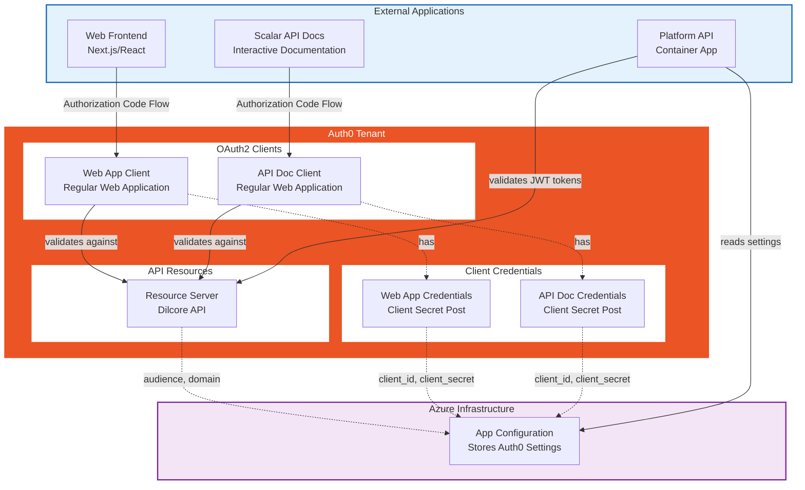

# Auth0 Infrastructure Module

This module manages Auth0 authentication and authorization resources for the Dilcore platform using Terraform.

## Overview

Auth0 provides identity and access management for the Dilcore platform. This module provisions and configures:
- **API Resource Server** - Represents the Dilcore API and defines the OAuth2 audience
- **Web Application Client** - Enables authentication for the web frontend
- **API Documentation Client** - Provides OAuth2 authentication for Scalar API documentation

All resources are environment-specific (development, qa, staging, production) and integrate with the Platform API through Azure App Configuration.

## Architecture



## Resources Created

### 1. Resource Server (API)

**Resource:** `auth0_resource_server.api`

Represents the Dilcore API as an OAuth2 resource server.

- **Name:** `Dilcore API {environment}`
- **Identifier (Audience):** `https://api.{environment}.dilcore.com` (or custom via `api_identifier` variable)
- **Signing Algorithm:** RS256
- **Token Lifetime:** 86400 seconds (24 hours)
- **Offline Access:** Enabled for refresh tokens
- **Skip Consent:** Enabled for first-party clients

### 2. Web Application Client

**Resource:** `auth0_client.web_app`

OAuth2 client for the Dilcore web frontend application.

- **Name:** `Dilcore Web App {environment}`
- **Application Type:** Regular Web Application
- **Authentication Flow:** Authorization Code Flow with PKCE
- **OIDC Conformant:** Yes
- **JWT Algorithm:** RS256

**Configuration Variables:**
- `web_app_callbacks` - Allowed callback URLs after authentication
- `web_app_allowed_logout_urls` - Allowed URLs after logout
- `web_app_web_origins` - Allowed origins for CORS

### 3. API Documentation Client

**Resource:** `auth0_client.api_doc`

OAuth2 client for Scalar API documentation with interactive authentication.

- **Name:** `Dilcore API Docs {environment}`
- **Application Type:** Regular Web Application
- **Authentication Flow:** Authorization Code Flow
- **OIDC Conformant:** Yes
- **JWT Algorithm:** RS256

**Configuration Variables:**
- `api_doc_callbacks` - Allowed callback URLs (includes localhost for local development)
- `api_doc_allowed_logout_urls` - Allowed logout URLs
- `api_doc_web_origins` - Allowed origins for CORS

### 4. Client Credentials

**Resources:** `auth0_client_credentials.web_app_credentials`, `auth0_client_credentials.api_doc_credentials`

Manages client secrets for both applications using the `client_secret_post` authentication method.

## Configuration

### Variables

| Variable | Description | Required | Default |
|----------|-------------|----------|---------|
| `auth0_domain` | Auth0 tenant domain | Yes | `$(AUTH0_DOMAIN)` |
| `auth0_client_id` | Terraform provider client ID | Yes | `$(AUTH0_CLIENT_ID)` |
| `auth0_client_secret` | Terraform provider client secret | Yes | `$(AUTH0_CLIENT_SECRET)` |
| `env_name` | Environment name | Yes | - |
| `api_identifier` | Custom API identifier | No | `https://api.{env_name}.dilcore.com` |
| `web_app_callbacks` | Web app callback URLs | No | `[]` |
| `web_app_allowed_logout_urls` | Web app logout URLs | No | `[]` |
| `web_app_web_origins` | Web app CORS origins | No | `[]` |
| `api_doc_callbacks` | API doc callback URLs | No | `[]` |
| `api_doc_allowed_logout_urls` | API doc logout URLs | No | `[]` |
| `api_doc_web_origins` | API doc CORS origins | No | `[]` |

### Environment-Specific Configuration

Configuration is managed through `terraform.tfvars` files in the `environments/` directory.

**Example:** [environments/development/terraform.tfvars](environments/development/terraform.tfvars)

```hcl
env_name                    = "development"
web_app_callbacks           = ["http://localhost:3000/api/auth/callback"]
web_app_allowed_logout_urls = ["http://localhost:3000"]
web_app_web_origins         = ["http://localhost:3000"]

api_doc_callbacks           = ["$(PLATFORM_API_BASE_URL)/api-doc/", "https://localhost:7191/api-doc/", "https://dev.api.dilcore.com/api-doc/"]
api_doc_allowed_logout_urls = ["$(PLATFORM_API_BASE_URL)/api-doc/", "https://localhost:7191/api-doc/", "https://dev.api.dilcore.com/api-doc/"]
api_doc_web_origins         = ["$(PLATFORM_API_BASE_URL)/api-doc/", "https://localhost:7191/api-doc/", "https://dev.api.dilcore.com/api-doc/"]
```

> [!NOTE]
> The `$(PLATFORM_API_BASE_URL)` placeholder is replaced during CI/CD deployment with the actual Platform API URL from Azure App Configuration.

## Outputs

The module exports the following values for integration with other infrastructure components:

| Output | Description | Sensitive |
|--------|-------------|-----------|
| `api_audience` | OAuth2 audience identifier for the API | No |
| `api_domain` | Auth0 tenant domain | No |
| `api_id` | Auth0 API resource ID | No |
| `web_app_client_id` | Web application client ID | No |
| `web_app_client_secret` | Web application client secret | Yes |
| `api_doc_client_id` | API documentation client ID | No |
| `api_doc_client_secret` | API documentation client secret | Yes |

### Integration with Azure App Configuration

Auth0 outputs are stored in Azure App Configuration and consumed by the Platform API:

```json
{
  "WebApi": {
    "AuthenticationSettings": {
      "Auth0": {
        "Domain": "$(AUTH0_API_DOMAIN)",
        "ClientId": "$(AUTH0_API_DOC_CLIENT_ID)",
        "ClientSecret": "$(AUTH0_API_DOC_CLIENT_SECRET)",
        "Audience": "$(AUTH0_API_AUDIENCE)"
      }
    }
  }
}
```

These placeholders are replaced during configuration deployment with actual values from Terraform outputs.

## Deployment

Deployment is automated through GitHub Actions using the [infra-auth0-deploy.yml](../../.github/workflows/infra-auth0-deploy.yml) workflow.

**Workflow Triggers:**
- Manual dispatch (`workflow_dispatch`)
- Changes to `infra/auth0/**` files on `main` branch

**Deployment Steps:**
1. Checkout code
2. Configure Auth0 provider credentials from GitHub secrets
3. Initialize Terraform with remote state backend
4. Plan infrastructure changes
5. Apply changes to Auth0 tenant
6. Export outputs to Azure App Configuration

## Local Development

To work with this module locally:

```bash
cd infra/auth0

# Initialize Terraform (skip backend for local testing)
terraform init -backend=false

# Validate configuration
terraform validate

# Plan changes for a specific environment
terraform plan -var-file=environments/development/terraform.tfvars

# Apply changes (requires Auth0 credentials)
terraform apply -var-file=environments/development/terraform.tfvars
```

> [!CAUTION]
> Local Terraform operations require Auth0 management API credentials. These should be set as environment variables or passed via `-var` flags. Never commit credentials to version control.

## Security Considerations

- **Client Secrets:** All client secrets are marked as sensitive and should only be accessed through secure channels (Azure App Configuration, GitHub Secrets)
- **CORS Origins:** Carefully configure allowed origins to prevent unauthorized access
- **Callback URLs:** Only whitelist trusted callback URLs to prevent OAuth redirect attacks
- **Token Lifetime:** 24-hour token lifetime balances security and user experience
- **OIDC Conformant:** All clients use OIDC-conformant flows for enhanced security

## Related Documentation

- [Main Infrastructure Overview](../../README.md)
- [Configuration System](../../configurations/README.md)
- [Platform Infrastructure](../platform/README.md)
