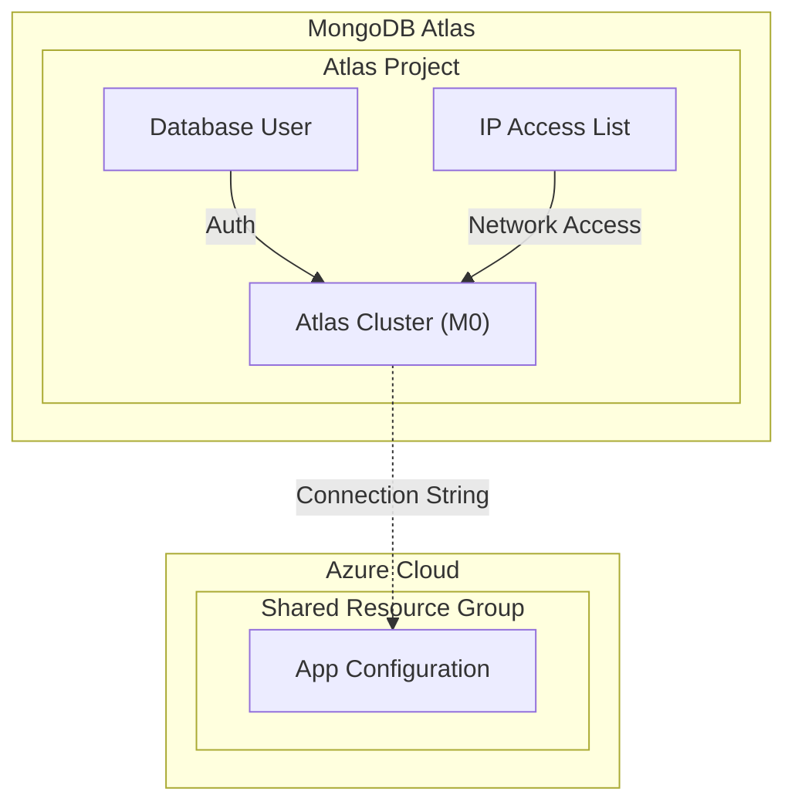

# MongoDB Infrastructure

This directory contains the Terraform configuration for the MongoDB infrastructure, hosted on MongoDB Atlas.

## Resources Created

The following resources are provisioned by this module:

- **MongoDB Atlas Project**: A project within the MongoDB Atlas organization.
- **MongoDB Atlas Cluster**: An advanced cluster configured as **M0 (Free Tier)** hosted on Azure (backing provider).
- **Database User**: A MongoDB user with read/write access.
- **IP Access List**: Network access configuration for the cluster. **Note:** During this initial implementation phase, access is enabled from anywhere (`0.0.0.0/0`) without IP restrictions.
- **App Configuration Key**: Stores the MongoDB connection string in the shared Azure App Configuration.

## Resource Visualization

