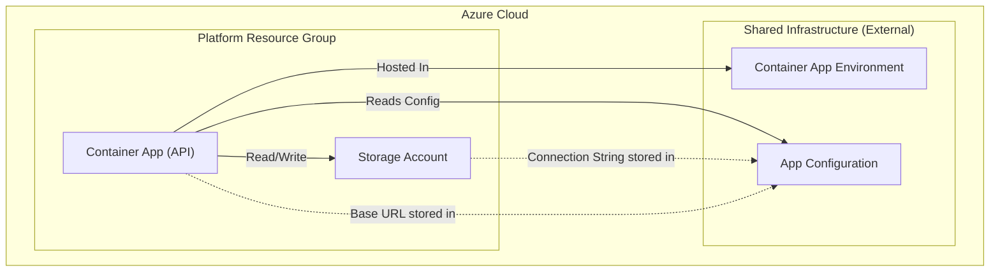

# Platform Infrastructure

This directory contains the Terraform configuration for the platform-specific infrastructure, primarily focusing on the API Container App and its supporting storage.

## Resources Created

The following resources are provisioned by this module:

- **Resource Group**: A dedicated resource group for platform components.
- **Container App (API)**: The main API application running in the Container App Environment.
- **Storage Account**: Used for grain storage and other data persistence needs.
- **Role Assignments**:
  - Grants the Container App access to read from App Configuration.
  - Grants the Container App "Storage Blob Data Contributor" access to the Storage Account.
- **App Configuration Keys**: Stores storage connection strings and API base URL in the shared App Configuration.

## Dependencies

This module relies on resources created in the `shared` module:
- **Container App Environment**: To host the Container App.
- **App Configuration**: To store and retrieve settings.

## Resource Visualization

