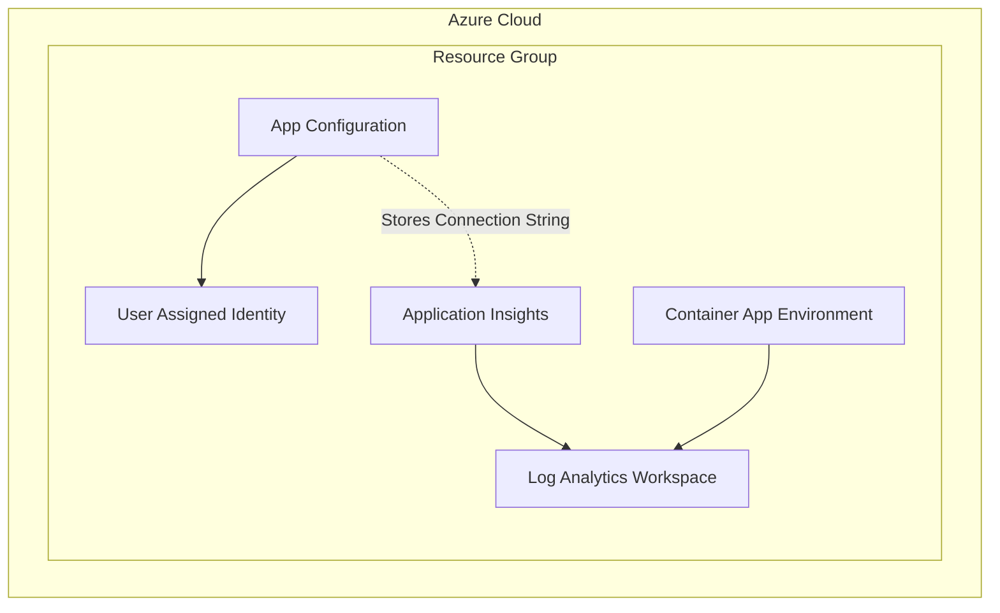

# Shared Infrastructure

This directory contains the Terraform configuration for the base shared infrastructure components of the Dilcore project. These components serve as the foundation for other infrastructure modules.

## Resources Created

The following resources are provisioned by this module:

- **Resource Group**: A container that holds related resources for an Azure solution.
- **Log Analytics Workspace**: Used to collect and analyze telemetry data from the environment.
- **User Assigned Identity**: Managed identity for secure access to other Azure resources.
- **Azure App Configuration**: Centralized service to manage application settings and feature flags.
- **Application Insights**: Application performance management service.
- **Container App Environment**: A fully managed environment for running microservices and containerized applications.

## Resource Visualization

## Usage

This module is intended to be applied first as it provides dependencies (like the Container App Environment and App Configuration) required by other modules such as `platform`.
